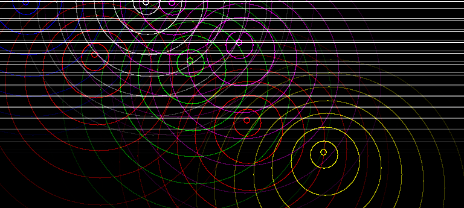

# asyncEn
asyncEn is a minimalistic environment for testing AI algorithms that consume events such as spiking neural networks.  
The simulation takes place on a surface and generates waves during collisions and kicks.  
This is the simplest environment I could write.  Everything is a circle or a horisontal/vertical line to simplify collision detection.  
Agents driving objects' behavior send momentary actions and receive events from the environment.  
Actions are left/right/forward kicks to propell the objects.  Events include collisions and wave interactions.  

  

Circular waves are generated when objects move.  Straight lines propagate out from walls when they get hit. In this case top wall got hit by two entities and straight lines are moving down.  Waves dissipate and faint as they move away from the source.  This should allow agents to determine distances to object that generated the waves.  

# Simulation Goals
The first goal of the simulator is to train agents to avoid collisions in the environment.  Agents will have to learn continuously because at some point (surprise! surprise!) agents will change the speed at which they are traveling (not the velocity).  This will test algorithms for continual learning and an ability to learn from non-stationary processes. Agents will receive collision and wave events.  

# Techical details
Simulation is written in C++ by hand (no AI has touched this code as of Apr 2026).  
The only library dependency is SDL2.  It has to be installed.  
Agents are stand alone stdio-style executables.  See [easya.cpp](easya.cpp) for a complete sample random agent implementation.  
Run ```make; asyncen easya keypad``` to see how things run.  You can click on keypad window and use UP/LEFT/RIGHT arrows to move one agent around.  

# Other simulators
I've thought about using [Box2D](https://box2d.org) to simulate physics since it also generates events.  However it seems that shapes are immutable.  You cannot modify their properties like radius after creation.  Deleting and creating wave objects to check collisions on every frame might be too expensive or even impossible.  

<details>
Last updated 10/2025
</details>
